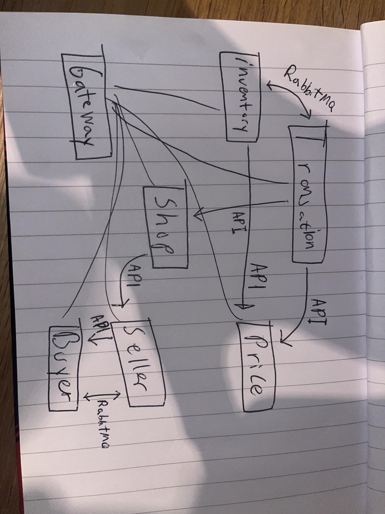

<h1> SEAFOOD MARKETPLACE <h4>Torshov-Labs©</h4>
</h1>
This application is supposed to be a platform where fishermen can sign up and 
sell their fresh fish to potential buyers. It's supposed to improve the way of buying
by making it easier for the customer to buy, and easier for fishermen to sell.

With the service files and components, you can see alot of unfinished 
functionality and potential user stories. The reason I have used a lot of components
is that I prefer the services and controllers dumb. I did not know how big some of my services
would become, so I have used a lot of different structures in my services.
If id have a service that became really big, I would consider having a folder for 
each type of "domain"/category of services, and make folders and files for each story
so iot should become easy to find what you were seeking for. This however, did not make
sense for me to do here since, as you can see, alot of the services are in reality very
small.

I have tried keeping the controllers and services as dumb as possible, but you know how programming works :)

I will now provide you with scripts and commands relevant for this microservice cluster to run.
following this, i will give you the most central user-stories, that makes out the bedrock
of this application. As i said above, there are plenty of functionality her, some sadly not finished
but most finished but not yet integrated with an endpoint. 

# SCRIPTS  -  GETTING THE SERVICE UP AND RUNNING

As we spoke about in class I will provide you with the scripts for setting up my desired Postgres schemas, with data.
As we also spoke about in class, I use mongoDb for some of my services. There, i have made you dummy accounts able to 
access my databases. 

The postgres (backup of my databases, so you will get identical to those I worked with) scripts lay in the scripts folder
and under database.

If against all odds, the connection to mongodb times out, here is what I have used as testing in my price database.
So if it doesn't work, i would appreciate if you made a quick mock database with this document. Regarding the Transaction 
service if it doesn't work, you can connect it to a new an empty one as it does not require any existing data to test and work

    {
        "_id": "123e4567-e89b-12d3-a456-426614174000",
        "prices": [
            {
                "seafoodType": "TUNA",
                "price": { "$numberDouble": "25.75" }
            },
            {
                "seafoodType": "COD",
                "price": { "$numberDouble": "22.0" }
            },
            {
                "seafoodType": "SALMON",
                "price": { "$numberDouble": "10.0" }
            }
        ]
    }

I made script for running the desired microservices in the script folder. However, as i had a few problems with that at
times, where some services would not shut down, I recommend you just running them manually from intellij one by one...

# GOOD TO KNOW  -  
**SMALL THINGS THAT MIGHT HELP YOU THROUGH THE GRADING**

    SELECT
         c.catch_id,
         c.seafood_type,
         c.kilos AS total_caught,
         COALESCE(SUM(s.kilos), 0) AS total_sold,
         (c.kilos - COALESCE(SUM(s.kilos), 0)) AS remaining_inventory
    FROM
        "catch" c
    LEFT JOIN
        sale s ON c.catch_id = s.catch_id
    GROUP BY
        c.catch_id;

If you want to check inventory before adjusting the payload for different responses etc, 
you can check inventory with this query in the _seafood_inventory_dev_-database. This gives you a nice overview.
You can also use the endpoints in my controllers! :)

i am however sorry for the unnescesary files and folders in this project. I am just 
scared that by deleting something, it suddenly does not work... You can look away from the services that are not
in use like the "boat" "weather" "fishstore-service"

I am also sorry if i have forgotten anything in the gateway. i tried using the ** but it sometimes did not work.
i could also not append lines, hence it is messy...

there might also be some misses on the urls for the usersories. THe gatewayy is 8000. If gateway by some chance doesnt 
work, you can send to the services directly. However, i do not think that would be nescesarry.

Also, i am sorry if i have not cleaned my mvn. Throughout this project i have had a problem with it not wanting to
install. You can however clean and install it before starting up the services :)

If you don't get the postgres scripts to work, you can open them as txt files and extract the necessary lines to construct
a script.

<h2> Remember to run up Rabbit and Consul! </h2>

In terminal for consul:

    consul agent -dev

In terminal for Rabbit:

    rabbitmq-server start

# SERVICES 
**WHAT ARE THE DIFFERENT SERVICES AND WHAT ARE THEIR PURPOSE?**

<h3> Seller & Buyer service </h3>

As I have talked about in the reflection. These services manages the users, but since the application in a way feel
different for  the seller and buyer, it made sense to splice it into separate services

<h3> Price Service </h3>

It did not make sense to keep the price in any of the other services. The price as said is a list connected to the store.
It only made sense to do it through a NoSQL. It did not make sense to keep them in the inventory either, as they would 
then had to (for example) be repeated in each catch.  

<h3> Shop Service </h3>
The shop kind of connects everything togheter. As the price's  id is the shopID, and sellers are connected to shops. 
Sales are connected to shops and services like Transaction checks if shops exist.

<h3> Transaction service </h3>

The transaction service is a central part of this application. It uses mongoDB as database for the reason
being that it has a list inside. The reason I chose NoSQL, was so that I did not have to create a database that needed
multiple tables etc. We can compare it to the shop service in the way that it stores user (sellers) in a separate table.
That did not make sense for me to do with a Transaction.

You can check out the _TransactionController_ to look at its **user stories**. For example: placing an order, and picking 
up an order is functionallity you can find there.

<h3> Inventory </h3>

Also a central service in my application. This calculates a inventory depending on catches and sales, while also taking 
requests on sales etc from the transaction service. You can look into the **_TransactionProcessorComponent_** on how 
sales are made. If you for example buy a list of items, and the first sales goes through but not the last one, it will 
not make any of the sales.     

<h3> Gateway </h3>
Gateway service for the other services. Through consul, with loadbalancer and health checking 

# USER STORIES  -  WHAT MAKES THIS PROJECT UNIQUE AND WHY DID I DO THINGS THE WAY I DID?

<h3> A seller can update his inventory </h3>

A seller is able to post his catches, and depending on what he has caught vs sold, the inventory will automatically 
calculate itself. Through different endpoints, we can see a sellers storage of both total caught (forex ample) salmon, and 
remaining kilos of a batch of salmon. As you might have caught on, the inventory service nor database does not keep count
on the inventory itself, but rather calculates it by how much is left from (one or multiple catches, depending on scenario)
a catch. I have also made a service for a static inventory, which a user in the future should be able to chose which one
he would prefer, as the (main)inventory we are talking about here requires more commitment from the user. We can talk 
more about the Static inventory later.  

<h3> A buyer buys from a seller </h3>

        Postman payload: # change to gateway host

**Post request to ↓**      
          
    http://localhost:8083/api/transactions/placeOrder

Use this as the body:

    {
      "shopId": "123e4567-e89b-12d3-a456-426614174000",
      "buyerId": "123e4567-e89b-12d3-a456-426614174002",
        "items": [
          {
            "seafoodType": "TUNA",
            "kilos": 0.25,
            "pricePerKilo": 25.75
          },
          {
            "seafoodType": "SALMON",
            "kilos": 0.25,
            "pricePerKilo": 10
          }
        ]
    }

**This user story interacts across the _inventory_, _shop_, _transaction_ and _price_ services.**

You can try adjusting the payload for testing. Different adjustments will yield different behaviours and 
database annotations from the server. I have allocated time to make the system _sort of_ debug errors by 
using and updating statuses on transactions. So by changing the price for example, you will get an error 
status reflecting that. Same by changing price, trying more kilos than what's actually "_possible_"/available
or buying items that do not exist. 

When you check out this function, you can see its advanced. The inventory is able to create a sale on multiple 
catches and different seafoods at once. Say that there are two catches of salmon, the algorithm will take from 
the one where the expiry date is closest and then continue to the next catch. They will have different saleId's, 
but the transaction ID will be the same. That's because that is how I think it will be the easiest to track down
a sale later on. You can also buy more than one item at once if you want! :D  

**Success**: Order placed with ID: 0566ebfb-a740-40f0-bb36-33f7efc610bd. Awaiting confirmation.

Through the logs you can see how the inventory responds, and updates the Status of the transaction.

The reason the checking of price is an api call, and not a message that later updates the status, is because that
would create a lot of problems if it turned out to be false later and the sales were made in the inventory service. 
That would lead to a lot of complications as it would have to send a new message again to inventory regarding the prices
being wrong and that they need to get deleted. That i would want to get confirmed also. And as we then see, it doesnt make
sense at all to make the price async. 

**This is based on the _first_ user story from the _arbeidskrav_:**
_As a buyer, I want to select seafood from a seller, have the transaction verified for price accuracy and inventory 
availability, and complete the purchase smoothly._

<h3> A buyer notifies that he picked up his order </h3>

I would recommend you keep a transaction ID of one of those you tried, 

**Key**: Content-Type

**Value**: application/json

    http://localhost:8080/api/transactions/pickup

**@RequestBody / PickupRequestDTO / Body** (raw, JSON): 

    {
      "transactionId": "123e4567-e89b-12d3-a456-426614174000"
    }

A successful request should return a 200 OK status

I noticed how important it was for shops using TooGoodToGo to see that you had "swiped" when picking up an order,
so I thought why not add it myself? So when the user picks up (would be a swipe on a app or something), a dto is sent 
to the server containing the transactionID, and it updates the status to COMPLETED and sets the time as pickup timestamp. 

<h3> An overview of a shops inventory: </h3>

    http://localhost:8000/api/inventory/compact/123e4567-e89b-12d3-a456-426614174000

This displays a compact overview of a shops inventory, which is important for the frontend and seller to know 
how much he has left from a stock.

_We also have an endpoint here for a close overview of an inventory._

    http://localhost:8000/api/inventory/seller/6345084b-084d-473a-9465-e74ac2ab5a6b

<h4> Init a new shop </h4>

**Method**: POST

**URL**:

         http://localhost:8000/initialize?userId=123e4567-e89b-12d3-a456-426614174000

**Headers** -> Content-Type: application/json

**Body**:

    {
      "shopName": "Tore sin krok",
      "description": "Den beste fisken finner du i enden av Brosundet!",
      "location": "Apotekergate 1",
      "locationDescription": "Mellom 2 gule bygg",
      "contactInfo": "46705858"
    }

This takes in a _CreateShopDTO_ for the required information on initializing a new shop.

**Success**: If the shop is created successfully, you should receive a 200 OK response with the created shop's data. This 
should not return the data in the real world, but it is nice when working and testing.

**Error**: If there's an error, you'll receive an error response.

<h3> A User transfers his buyer account to a seller </h3>

**URL**:

    http://localhost:8000/api/sellers/transfer/{buyerId}

@PathVariable UUID buyerId

fornow, there is not that much i in the _BuyerToSellerDTO_ it was mostly for testing etc.
Payload

this endpoint is located in the sellerservice, so it creates the seller, but sets it as deactivated until it recives a
message back from the buyer service that the buyer was turned off. Then it activates the seller. It also does an api 
call to check if the id exists. the reason i chose to do a rabbit message for the deactivation was that it did not nead 
to synchronous 

A buyer account can request to make his buyer-account turned into a seller account. 

# Adjustments regarding the _arbeidskrav_

As the production goes on, prioritisation change. Hence, i chose to focus on new functionality for improving my 
knowledge rather than building forward on existing functionality i already had. That is why I for example did 
not do the User story number 3 from my _arbaidskrav_. I do know how to do it thought, it would be an endpoint, very much 
like the one existing for picking up orders, but instead sending a request for canceling. I would then have to check if 
its too close or after the pickup-date, followed by sending a message to sale for removing the sale for freeing up the inventory
I rather prioritized to make the shop- and user-services, binding sellers to shops so that one shop could have multiple 
accounts connected to a shop. As I have mentioned above, I started out by connecting sales, inventory, transactions etc
to specific sellers instead of a centralized shop (which I implemented later).  

I would appreciate if you went through my controllers/services to see functionality I have made. There are a more 
than what I mentioned above.

<h4> Unfinished Services </h4>
As you might have guessed, I had a lot of different ideas that did not make the deadline... The first I wanted to mention
was the **_weather service_**. I thought that a little service that would show the weather (to the buyers) for the upcoming 
days the seller would be ashore would be cool. That could help drive traffic for sellers as it might be more appealing 
for a buyer to go out of his way if they could easily see the weather for that day. This could have been combined with 
(or together with a )calendar service, or keeping the calendar of the store, in the store service, since that makes 
sense too.

A **_UUID service_** was also something i worked on. that could be nice for centralizing UUID creation and as a place for support to brows UUID's etc. This could
of course come with cons, as for example, it could create a bottleneck for the other services. A scenario could be that
the UUID service went down, and if every service depended on it, they would also in a way get defected. This coupling
could be battled by doing it in a try-catch or some sort of timeout, and making it locally (in its own service) instead
of calling the UUID service.

The Static Inventory is also a service I made. It was however too easy since it did not focus on the batches and
calculating like the current inventory. It was nice to work with at the start but was boring. I think however, that i
can be useful in _real life_, as it doesn't require that much commitment from a shop as the other inventory. With this
one, a shop can just list how much they want to sell and go from there. In a fully developed, well aged solution, a shop
should have the option to chose between the inventory service it would want to use.

# Collaboration

_I did not collaborate with anyone on this application_
